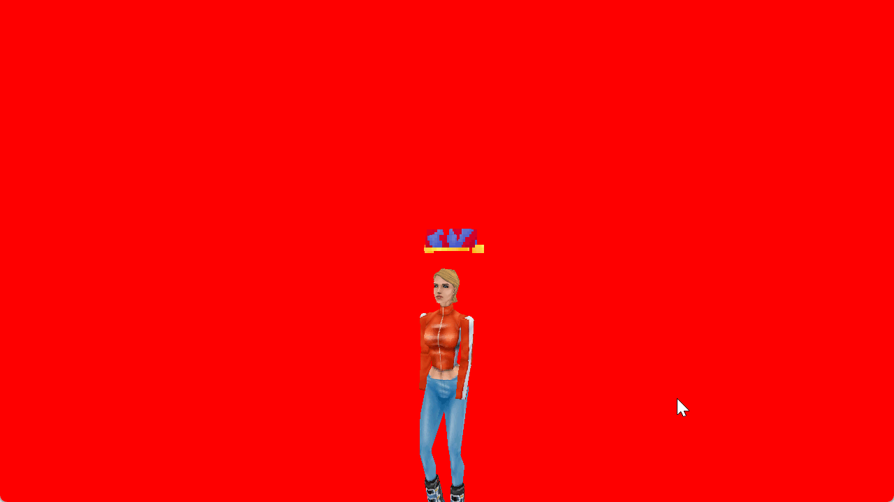

<h1 align="center">🖼️ ObjLoaderTests 🖼️</h1>

It all started as a simple `.obj` model loader... but I craved knowledge, I wanted to know how you can create and apply animations to a skeletal model.

So that's why I also coded a The Sims 1 `.skn`/`.cmx`/`.cfp` loader too! Yeah, The Sims 1 skeletons are very simple (no weight mapping, only one bone per vertex), but now I do have the knowledge of how this works, so in the future I can improve it further.

The animation code is borked beyond salvation tho, I need to swap the arm bones because, if I don't do that, the arms are wonky because their animations are swapped (?).

Also I don't apply the base skeleton rotation, not sure if it is needed but, when applying it, the animation becomes all borked... but I do translate based on the base skeletion + animation transform.

## Screenshots

## Resources

* https://web.archive.org/web/20050501050322/http://simtech.sourceforge.net/tech/cfp.html
* https://github.com/mixiate/ts1-blender-io/